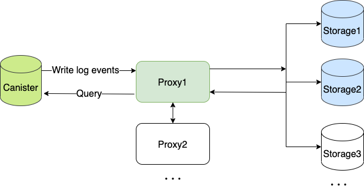

## What is ICES

**ICES (Internet Computer Event System)** is a canister custom event log storage and analysis service on Dfinity. Any canister can access ICES without permission, store the interactive data permanently, and query it through the public API and dashboard provided by ICES.


## 🔗 Links

* Website **[https://ices.one/](https://ices.one/)**
* Twitter **[https://twitter.com/icesHQ](https://twitter.com/icesHQ)**
* Code **[https://github.com/icpfans-xyz/ices-contract](https://github.com/icpfans-xyz/ices-contract)**


# Concept
* Proxy Canister: Log data write and query entry. dispatch log data to stroage canister
* Storage Canister: Canister for storing data





# Local run

If you want to test your project locally, you can use the following commands:

```bash
# Starts the replica, running in the background
dfx start --background

# Deploys your canisters to the replica and generates your candid interface
dfx deploy
```

# How to test

```bash
# Run the file test.sh
./test.sh

```

